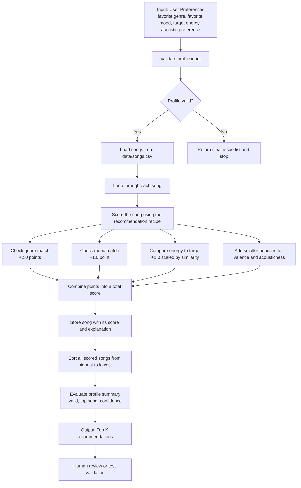

# Recommendation Flow

The verified implementation follows a small reliability loop in addition to the scoring loop. The profile validator checks whether the user input is in a sensible range before the system continues, and the evaluation step then returns a compact summary describing whether the profile passed the guardrail and how much confidence to place in the top result. This makes the recommendation pipeline more transparent without changing the underlying content-based approach.
